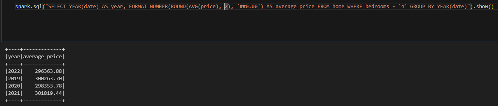
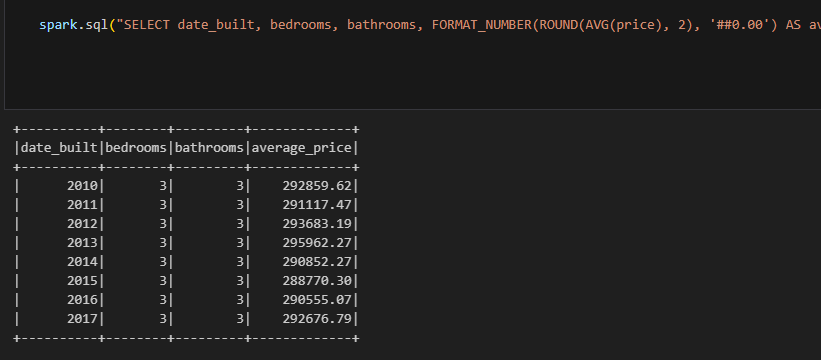
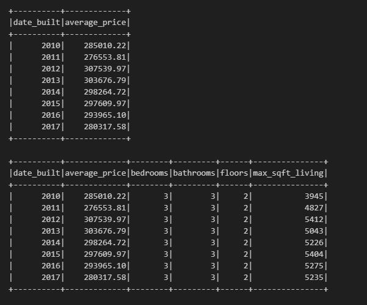
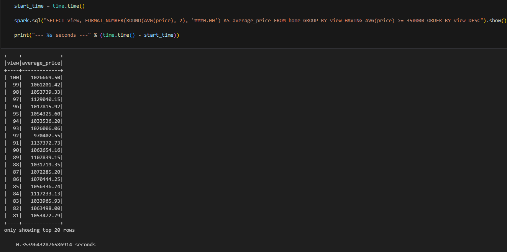
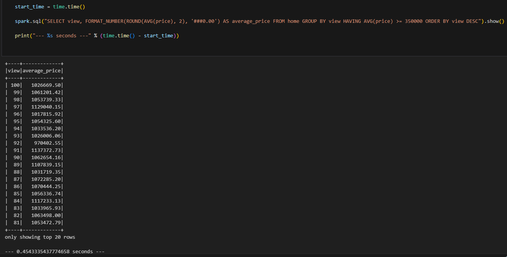
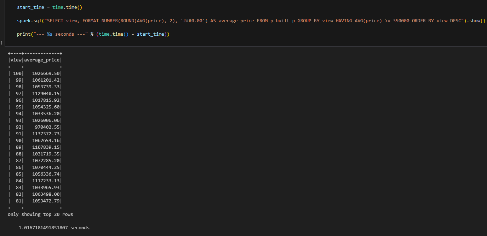

# Home_Sales

# Summary

This project utilizes SparkSQL to analyze home sales data, including calculating average prices based on various criteria and optimizing query performance. Tasks involve creating temporary views, partitioning data, caching tables, and comparing query runtimes. The results are saved in a Jupyter Notebook and uploaded to a GitHub repository named "Home_Sales."
The Starter_Code folder contains the solution code for Google CoLab. 

# Questions & Answers

# 1. What is the average price for a four bedroom house sold per year, rounded to two decimal places?

# 2. What is the average price of a home for each year the home was built, that have 3 bedrooms and 3 bathrooms, rounded to two decimal places?

# 3. What is the average price of a home for each year the home was built, that have 3 bedrooms, 3 bathrooms, with two floors, and are greater than or equal to 2,000 square feet, rounded to two decimal places? 

The enclosed screen shot shows the query without additional columns and also with additional columns. 

# 4. What is the average price of a home per "view" rating, rounded to two decimal places, having an average home price greater than or equal to $350,000? Order by descending view rating. Although this is a small dataset, determine the run time for this query.

# 5. Cached runtime shown here for purposes of comparing it to number four's uncached runtime: 

# 6. Show the runtime with the Parquet data:

# Notes
Certain questions were relocated to a markdown cell within the solution file. 
This adjustment was made to enhance clarity for anyone reviewing the code, particularly 
enabling easier visibility of the longer queries separated from the questions.
